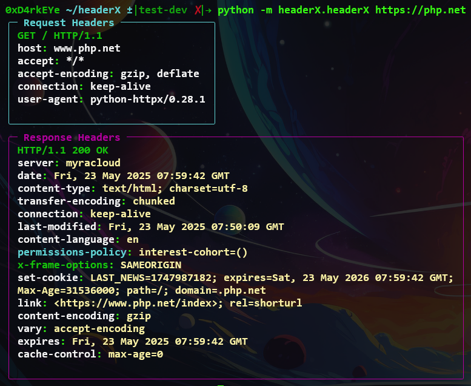

# HeaderX - HTTP Header Analyzer


HeaderX is a HTTP header analysis tool that fetches and categorizes request/response headers with color-coded output. It helps security researchers, developers, and system administrators quickly identify standard, security-related, experimental, and deprecated headers.

## Features

- 🎨 **Color-coded header classification** with Rich text formatting
- 🔍 **Automatic header categorization** (Standard, Security, Experimental, Deprecated, etc.)
- 🌐 **Follows redirects** automatically
- 📋 **Raw header display** with syntax highlighting
- ⚡ **Async HTTP requests** using httpx
- 📊 **Comprehensive header database** with 150+ classified headers

## Installation

1. Clone the repository:

```bash
   git clone https://github.com/Padmapriyan27/HeaderX.git
   
   cd headerX
```

2. Install dependencies:

```bash
   pip install -r requirements.txt --break-system-packages
```

3. Run directly:

```bash
   python -m headerX.headerX https://example.com
```

## Usage

Basic usage:

```bash
   python -m headerX.headerX [url]
```

Example:

```bash
   python -m headerX.headerX https://example.com
```

Help menu:

```bash
   python -m headerX.headerX --help
```

## Header Classification

HeaderX categorizes headers into the following groups with distinct colors:

| Category     | Color          | Description                    |
| ------------ | -------------- | ------------------------------ |
| Standard     | Bright White   | Official HTTP standard headers |
| Security     | Bright Green   | Security-related headers       |
| Experimental | Bright Cyan    | Experimental/draft headers     |
| Deprecated   | Bright Red     | Deprecated headers headers     |
| Non-std-dep  | Orange Red     | Non-standard Deprecated        |
| Non-standard | Bright Magenta | Common non-standard headers    |
| Unknown      | Dim            | Unrecognized headers           |

## Example Output



## Requirements

- Python 3.8+
- httpx
- rich

## Project Structure

```
headerX/
├── headerX/
│   ├── __init__.py
│   ├── headerX.py
│   ├── img/
│   │   ├── main_banner.png
│   │   └── output.png
│   └── modules/
│       ├── __init__.py
│       ├── handler.py
│       ├── header_analyzer.py
│       └── helper.py
└── requirements.txt
```
